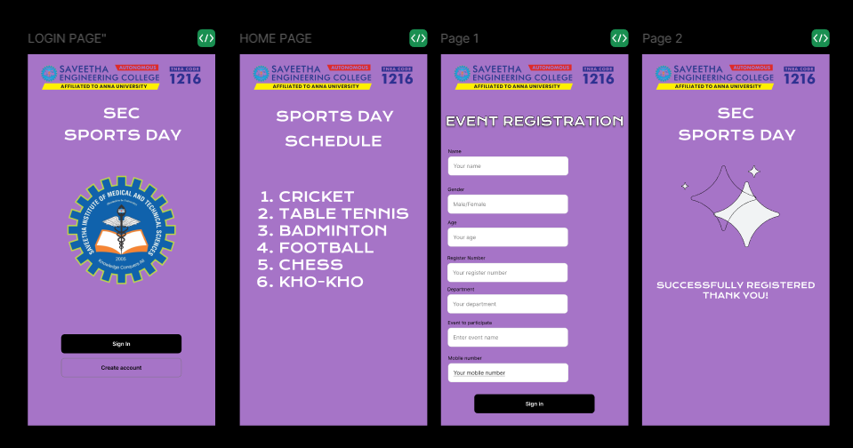

# Ex09 Event Registration Web Application
## Date: 14-05-2025

## AIM:
To design, develop and deploy a web application for event registration.

## DESIGN STEPS:

### Step 1:
Create a new frame.

### Step 2:
Select any one preset size of your choice.

### Step 3:
Select the shapes you need.

### Step 4:
Import images as needed.

### Step 5:
Create pages based on your need and link them.

### Step 6:

Validate the HTML and CSS code.

### Step 6:

Publish the website in the given URL.

## DESIGN TOOL:
Figma

## CODE:
LOGIN PAGE
```
<div style="width: 100%; height: 100%; position: relative; background: #A674C7; overflow: hidden">
    <div style="left: 220px; top: 148px; position: absolute"><span style="color: white; font-size: 40px; font-family: Krona One; font-weight: 400; word-wrap: break-word">SEC</span><span style="color: #CFEF51; font-size: 40px; font-family: Krona One; font-weight: 400; word-wrap: break-word"> </span></div>
    <div style="left: 105px; top: 212px; position: absolute; color: white; font-size: 40px; font-family: Krona One; font-weight: 400; text-transform: uppercase; word-wrap: break-word">SPORTS DAY</div>
    <div style="width: 353px; height: 56px; padding-left: 152px; padding-right: 152px; padding-top: 17px; padding-bottom: 17px; left: 98px; top: 822px; position: absolute; background: black; border-radius: 10px; justify-content: center; align-items: center; gap: 10px; display: inline-flex">
        <div style="text-align: center; justify-content: center; display: flex; flex-direction: column; color: white; font-size: 16px; font-family: Inter; font-weight: 600; line-height: 20px; word-wrap: break-word">Sign In</div>
    </div>
    <div style="width: 353px; height: 56px; padding-left: 152px; padding-right: 152px; padding-top: 17px; padding-bottom: 17px; left: 98px; top: 892px; position: absolute; border-radius: 10px; outline: 1px #747474 solid; outline-offset: -1px; justify-content: center; align-items: center; gap: 10px; display: inline-flex">
        <div style="text-align: center; justify-content: center; display: flex; flex-direction: column; color: black; font-size: 16px; font-family: Inter; font-weight: 600; line-height: 20px; word-wrap: break-word">Create account</div>
    </div>
    
    
</div>
```
HOME PAGE
```
<div style="width: 100%; height: 100%; position: relative; background: #A674C7; overflow: hidden">
    
    <div style="left: 105px; top: 157px; position: absolute; color: white; font-size: 40px; font-family: Krona One; font-weight: 400; text-transform: uppercase; word-wrap: break-word">SPORTS DAY</div>
    <div style="left: 131px; top: 230px; position: absolute; color: white; font-size: 40px; font-family: Krona One; font-weight: 400; text-transform: uppercase; word-wrap: break-word">SCHeDULE</div>
    <div style="left: 54px; top: 393px; position: absolute; color: white; font-size: 40px; font-family: Krona One; font-weight: 400; text-transform: uppercase; word-wrap: break-word">Cricket<br/>Table Tennis<br/>Badminton<br/>football<br/>chess<br/>kho-kho<br/></div>
</div>
```
PAGE 1
```
<div style="width: 100%; height: 100%; position: relative; background: #A674C7; overflow: hidden">
    
    <div style="left: 13px; top: 174px; position: absolute; color: white; font-size: 36px; font-family: Krona One; font-weight: 400; text-transform: uppercase; word-wrap: break-word; text-shadow: 0px 4px 4px rgba(0, 0, 0, 0.25)">EVENT REGISTRATION</div>
    <div style="left: 21px; top: 276px; position: absolute; flex-direction: column; justify-content: flex-start; align-items: flex-start; gap: 6px; display: inline-flex">
        <div style="justify-content: flex-end; display: flex; flex-direction: column; color: black; font-size: 14px; font-family: Inter; font-weight: 400; line-height: 17.50px; word-wrap: break-word">Name</div>
        <div style="width: 353px; padding-left: 16px; padding-right: 16px; padding-top: 18px; padding-bottom: 18px; background: white; border-radius: 10px; outline: 1px #D8DADC solid; outline-offset: -1px; justify-content: flex-start; align-items: center; gap: 10px; display: inline-flex">
            <div style="flex: 1 1 0; justify-content: flex-end; display: flex; flex-direction: column; color: rgba(0, 0, 0, 0.50); font-size: 16px; font-family: Inter; font-weight: 400; line-height: 20px; word-wrap: break-word">Your name</div>
        </div>
    </div>
    <div style="left: 20px; top: 485px; position: absolute; flex-direction: column; justify-content: flex-start; align-items: flex-start; gap: 6px; display: inline-flex">
        <div style="justify-content: flex-end; display: flex; flex-direction: column; color: black; font-size: 14px; font-family: Inter; font-weight: 400; line-height: 17.50px; word-wrap: break-word">Age</div>
        <div style="width: 353px; padding-left: 16px; padding-right: 16px; padding-top: 18px; padding-bottom: 18px; background: white; border-radius: 10px; outline: 1px #D8DADC solid; outline-offset: -1px; justify-content: flex-start; align-items: center; gap: 10px; display: inline-flex">
            <div style="flex: 1 1 0; justify-content: flex-end; display: flex; flex-direction: column; color: rgba(0, 0, 0, 0.50); font-size: 16px; font-family: Inter; font-weight: 400; line-height: 20px; word-wrap: break-word">Your age</div>
        </div>
    </div>
    <div style="height: 62px; left: 20px; top: 388px; position: absolute; flex-direction: column; justify-content: flex-start; align-items: flex-start; gap: 6px; display: inline-flex">
        <div style="justify-content: flex-end; display: flex; flex-direction: column; color: black; font-size: 14px; font-family: Inter; font-weight: 400; line-height: 17.50px; word-wrap: break-word">Gender</div>
        <div style="width: 353px; padding-left: 16px; padding-right: 16px; padding-top: 18px; padding-bottom: 18px; background: white; border-radius: 10px; outline: 1px #D8DADC solid; outline-offset: -1px; justify-content: flex-start; align-items: center; gap: 10px; display: inline-flex">
            <div style="flex: 1 1 0; justify-content: flex-end; display: flex; flex-direction: column; color: rgba(0, 0, 0, 0.50); font-size: 16px; font-family: Inter; font-weight: 400; line-height: 20px; word-wrap: break-word">Male/Female</div>
        </div>
    </div>
    <div style="left: 20px; top: 779px; position: absolute; flex-direction: column; justify-content: flex-start; align-items: flex-start; gap: 6px; display: inline-flex">
        <div style="justify-content: flex-end; display: flex; flex-direction: column; color: black; font-size: 14px; font-family: Inter; font-weight: 400; line-height: 17.50px; word-wrap: break-word">Event to participate</div>
        <div style="width: 353px; padding-left: 16px; padding-right: 16px; padding-top: 18px; padding-bottom: 18px; background: white; border-radius: 10px; outline: 1px #D8DADC solid; outline-offset: -1px; justify-content: flex-start; align-items: center; gap: 10px; display: inline-flex">
            <div style="flex: 1 1 0; justify-content: flex-end; display: flex; flex-direction: column; color: rgba(0, 0, 0, 0.50); font-size: 16px; font-family: Inter; font-weight: 400; line-height: 20px; word-wrap: break-word">Enter event name</div>
        </div>
    </div>
    <div style="left: 21px; top: 883px; position: absolute; flex-direction: column; justify-content: flex-start; align-items: flex-start; gap: 6px; display: inline-flex">
        <div style="justify-content: flex-end; display: flex; flex-direction: column; color: black; font-size: 14px; font-family: Inter; font-weight: 400; line-height: 17.50px; word-wrap: break-word">Mobile number</div>
        <div style="width: 353px; padding-left: 16px; padding-right: 16px; padding-top: 18px; padding-bottom: 18px; background: white; border-radius: 10px; outline: 1px #D8DADC solid; outline-offset: -1px; justify-content: flex-start; align-items: center; gap: 10px; display: inline-flex">
            <div style="flex: 1 1 0; justify-content: flex-end; display: flex; flex-direction: column; color: rgba(0, 0, 0, 0.50); font-size: 16px; font-family: Inter; font-weight: 400; line-height: 20px; word-wrap: break-word">Your mobile number</div>
        </div>
    </div>
    <div style="width: 321px; left: 37px; top: 925px; position: absolute; justify-content: flex-end; display: flex; flex-direction: column; color: rgba(0, 0, 0, 0.50); font-size: 16px; font-family: Inter; font-weight: 400; text-decoration: underline; line-height: 20px; word-wrap: break-word">Your mobile number</div>
    <div style="width: 321px; left: 37px; top: 925px; position: absolute; justify-content: flex-end; display: flex; flex-direction: column; color: rgba(0, 0, 0, 0.50); font-size: 16px; font-family: Inter; font-weight: 400; line-height: 20px; word-wrap: break-word">Your mobile number</div>
    <div style="width: 353px; height: 56px; padding-left: 152px; padding-right: 152px; padding-top: 17px; padding-bottom: 17px; left: 98px; top: 998px; position: absolute; background: black; border-radius: 10px; justify-content: center; align-items: center; gap: 10px; display: inline-flex">
        <div style="text-align: center; justify-content: center; display: flex; flex-direction: column; color: white; font-size: 16px; font-family: Inter; font-weight: 600; line-height: 20px; word-wrap: break-word">Sign in</div>
    </div>
</div>
```
PAGE 2
```
<div style="width: 100%; height: 100%; position: relative; background: #A674C7; overflow: hidden">
    <div style="left: 220px; top: 148px; position: absolute"><span style="color: white; font-size: 40px; font-family: Krona One; font-weight: 400; word-wrap: break-word">SEC</span><span style="color: #CFEF51; font-size: 40px; font-family: Krona One; font-weight: 400; word-wrap: break-word"> </span></div>
    <div style="left: 105px; top: 212px; position: absolute; color: white; font-size: 40px; font-family: Krona One; font-weight: 400; text-transform: uppercase; word-wrap: break-word">SPORTS DAY</div>
    
    <div style="width: 227px; height: 226.16px; left: 193.61px; top: 357.26px; position: absolute; background: #F1F3F4; border: 1px black solid"></div>
    <div style="width: 226.16px; height: 225.32px; left: 126.10px; top: 310px; position: absolute; border: 1px black solid"></div>
    <div style="width: 69.20px; height: 68.35px; left: 294.03px; top: 310px; position: absolute; background: #F1F3F4; border: 1px black solid"></div>
    <div style="width: 42.19px; height: 41.35px; left: 105px; top: 366.54px; position: absolute; background: #F1F3F4; border: 1px black solid"></div>
    <div style="left: 42px; top: 663px; position: absolute; color: white; font-size: 24px; font-family: Krona One; font-weight: 400; text-transform: uppercase; word-wrap: break-word">Successfully registered<br/>                 Thank you!</div>
</div>
```


## OUTPUT:


## RESULT:
The program to design, develop and deploy a web application for event registration is completed successfully.
